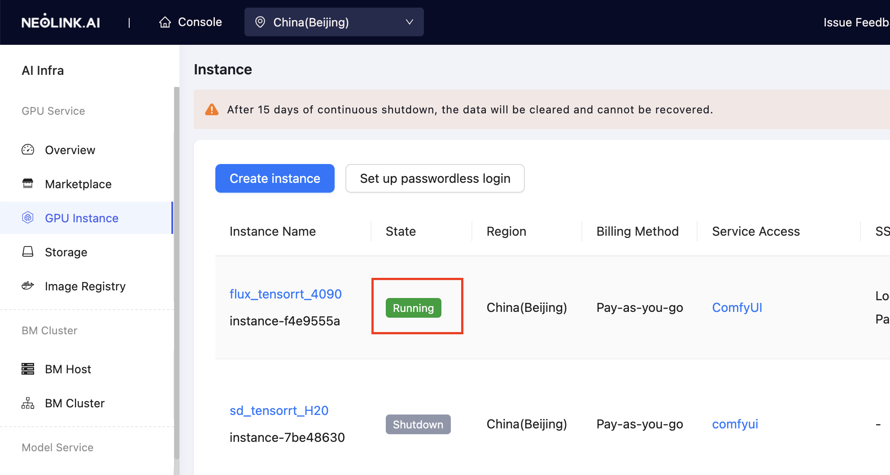

Compute instances are commonly used for algorithm development and model fine-tuning. If you are working with a small dataset, you can choose a single-GPU instance or an 8-GPU full machine instance. The platform provides local data disks and associated file storage. After completing your development or fine-tuning using the terminal, you can download your results and release the compute instance.

## Steps

1. Navigate to **GPU Instance** from the left sidebar and click **Create Instance**.

   

2. On the **Create Instance** page, select the **Payment Method** (pay-as-you-go, daily, weekly, or monthly billing), **GPU Model** (3090, 4090, H20, H100), **GPU Card**, and **GPU Specification**. Choose an **Image** (with built-in deep learning frameworks), and click **Create**. For instructions on creating a private image, refer to the [Images](../ConfigureEnvironment/image.md) section. If you require additional storage for your data, adjust the disk size accordingly.

   **NOTE**: Since instances with H100 GPUs cannot access the internet, we have provided customized images (with the **-h100** suffix) for these instances. These images redirect `pip` and `apt` to local mirrors, ensuring smooth package and dependency installation even in an offline environment. The local mirrors contain the same packages as the Tsinghua repository.

   

3. Return to the **GPU Instance** page and wait for the instance to be created. The created instance will appear in the list with the status **Running**.

   

4. After the instance is created, you can access it via JupyterLab or SSH for development and fine-tuning.
