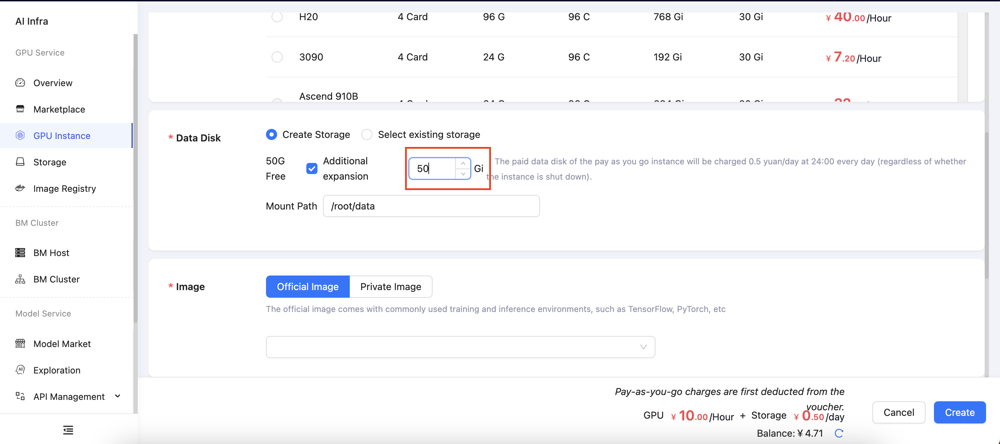
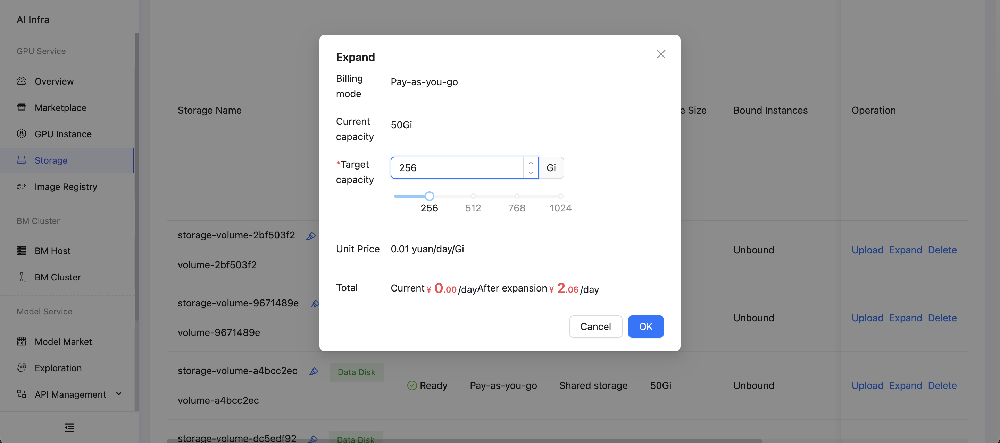

When creating an instance, the system will automatically provide a 50GB data disk for each host. If you find this space insufficient, you can increase the data disk capacity using the following two methods:

- **During Instance Creation**

  When creating an instance, select the option for additional expansion under the **Data Disk** section, and enter the desired storage capacity in the input field.

  

- **After Instance Creation**

  In the **Storage Management** section of the console, click the **Expand** button next to the instance. In the pop-up window, enter the target capacity size.

  
