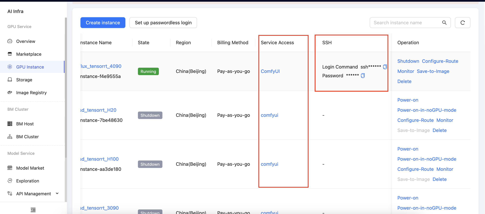

## Create an Instance

Go to the Overview page, navigate to **GPU Instance** in the sidebar, and click **Create Instance**.  

## Renting an Instance

On the **Create Instance** page, select the **Region**, **Payment Method** (pay-as-you-go, daily, weekly, or monthly), **GPU Model**, **Cards**, and **GPU Specification**. Choose the **Image** (pre-installed with different deep learning frameworks), and then click **Create**. If you need more disk space to store data, set the desired expansion size.

After the instance is created, wait for it to start. The primary operation entry points are shown below.

## Uploading Data

Go to the Overview page. After the instance is running, find the **JupyterLab** shortcut tool on the instance and open it. In the screenshot below, locate the **Upload** button to upload your data.  

If you need to upload folders or use more advanced upload methods, go to **Storage** in the sidebar, click **Upload**, and select the code or data you want to upload. It is recommended to place the data disk in the `/root/data` path of the instance.  

