## 这个demo做了什么？
实现了一个简单的神经网络来处理 MNIST 数据集。

具体为：
1.从网络下载大量的手写数字图像，是一个标准的机器学习训练数据集。计算模型在测试数据集上的准确率。它通过比较网络输出和真实标签来确定正确预测的数量。
2.最后 使用 TensorBoard 记录训练损失和测试准确率，可视化训练过程。

## 如何初步理解神经网络？
●神经网络可以看作是一种复杂的决策树，每个决策点（神经元）根据特定的规则（权重和激活函数）来决定数据的流向，最终达到决策的终点（输出结果）。
●神经网络的训练过程可以比喻为学习骑自行车。一开始，骑车者（神经网络）可能会摇摇晃晃，但随着练习（训练迭代），他们会逐渐学会如何保持平衡（找到正确的权重设置），最终能够熟练地骑行（准确预测）。

<pre>
demo1
├── 一、选取自己需要的算力实例
│  
├── 二、在Neolink.AI平台进行模型训练
│   
├── 三、运行结果解析和源代码
</pre>


# 一、选取自己需要的算力实例
https://neolink-ai.com/ 
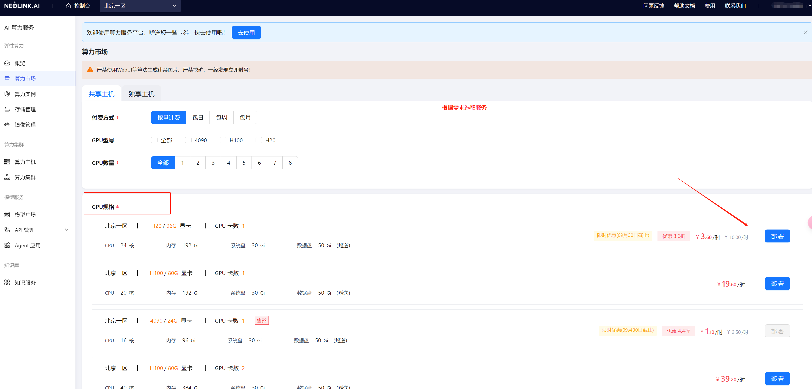
*注意： 在选取H100的时候需要选取后缀为100的镜像*

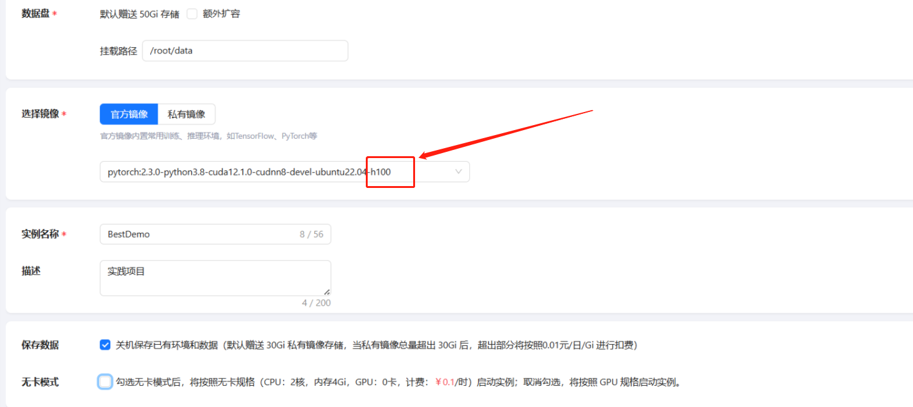

# 二、在Neolink.AI平台进行模型训练

## 实例代码
在这里我提供一份可以简单运行的代码。
需要在本地拷贝一份，方便后续传入实例服务器中，也可以通过git的方法直接下载。
```
git地址： https://github.com/mykana/NeoLink-Demo.git
如果不想git拉取，源代码在本文最后
```


## （1）上传数据的方式
#### 方式一：通过存储管理页，选择实例挂载的存储进行上传，存储默认挂载目录为/root/data


#### 方式二：通过Jupyterlab页进行上传。点击内置工具Jupyterlab链接进入控制台页，工作目录为/root，点击左侧目录data文件夹，进入该文件夹后
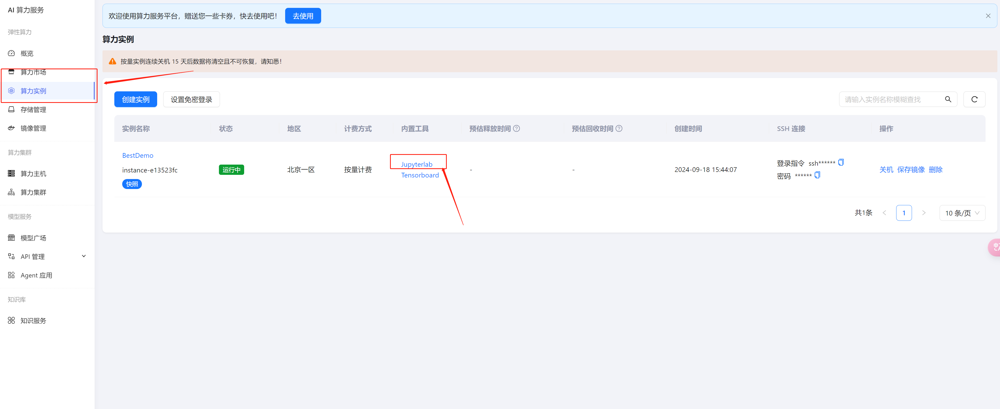
可以直接将文件拖入控制台中的文件夹，就可以上传文件
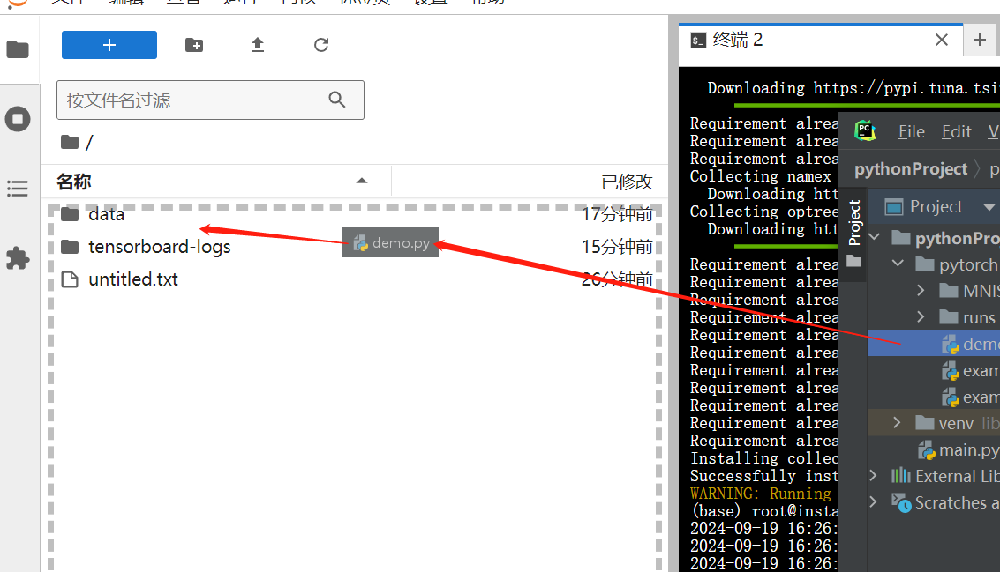
也可以选择上传按钮上传文件
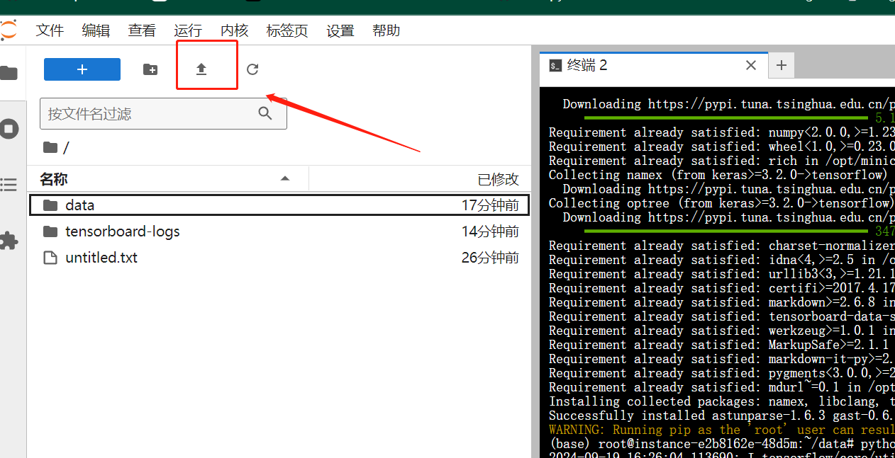
#### 方式三：通过ssh登入容器
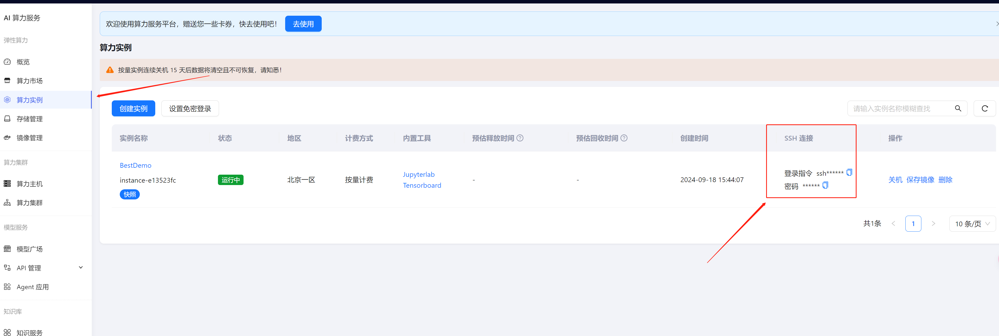

## （2）在这里我选用第二种，通过Jupyterlab页进行上传文件
直接将文件拖拽过去，或者mac电脑可以选择点击上传按钮上传
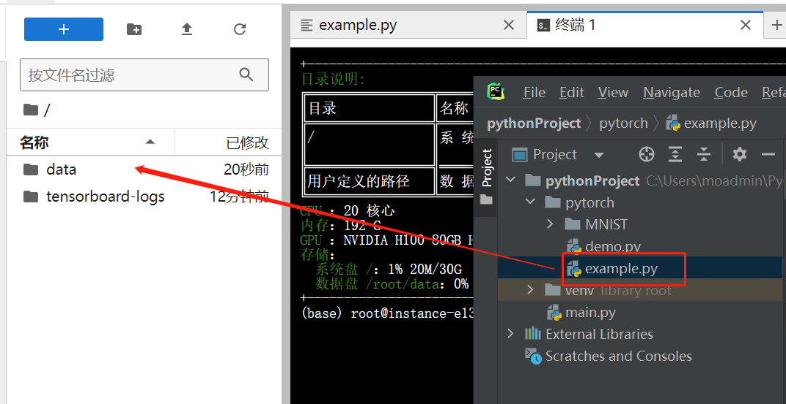

上传完成后打开一个终端页面，用于下载依赖库和运行代码


## （3）下载库依赖库 
```
pip install numpy torch torchvision matplotlib
```
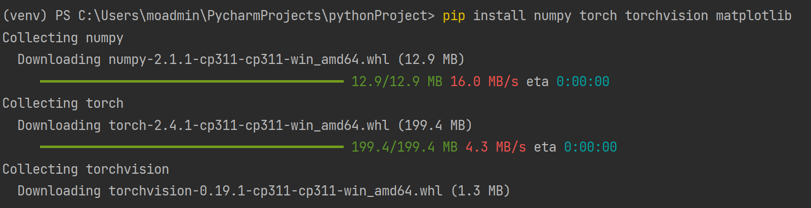
```
pip install tensorflow

```
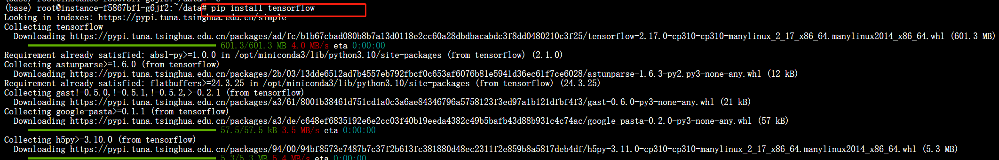

## （4）运行代码
#### 1.通过命令行找到py文件
> ll
> cd data
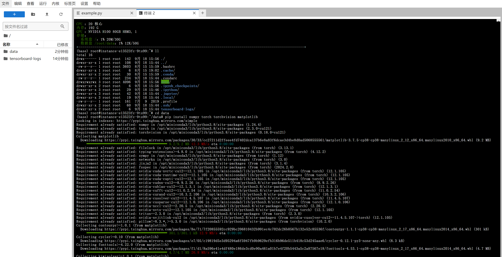

#### 2.通过webUI点击文件夹找到py文件
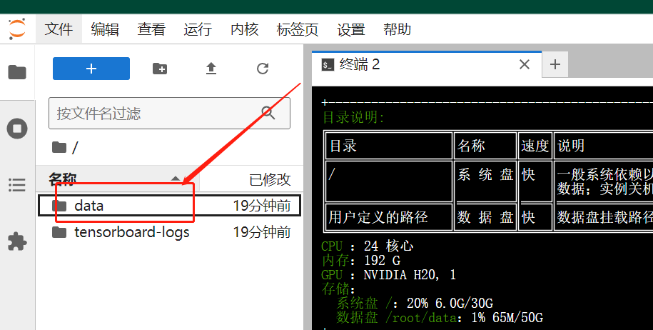
> python example.py

*通过python 文件名 可以直接运行py文件，对于这个demo来说，前提是依赖库已经安装完毕，就可以顺利运行*

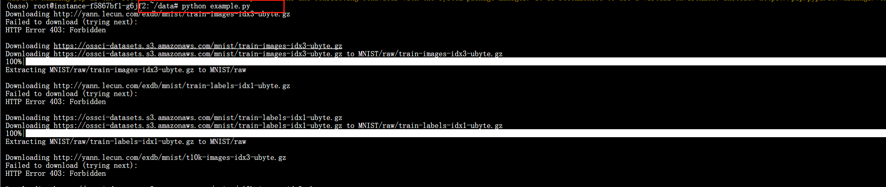
简易demo在本地window(CPU: AMD Ryzen 7 4800U)运行和实例H20(96G)运行时间对比

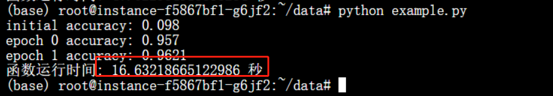
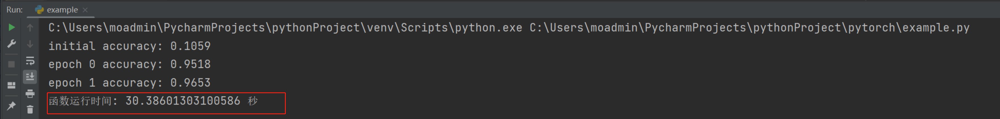

---

## 三、运行结果解析和源代码
云端通过Tensorboard查看模型线性结果


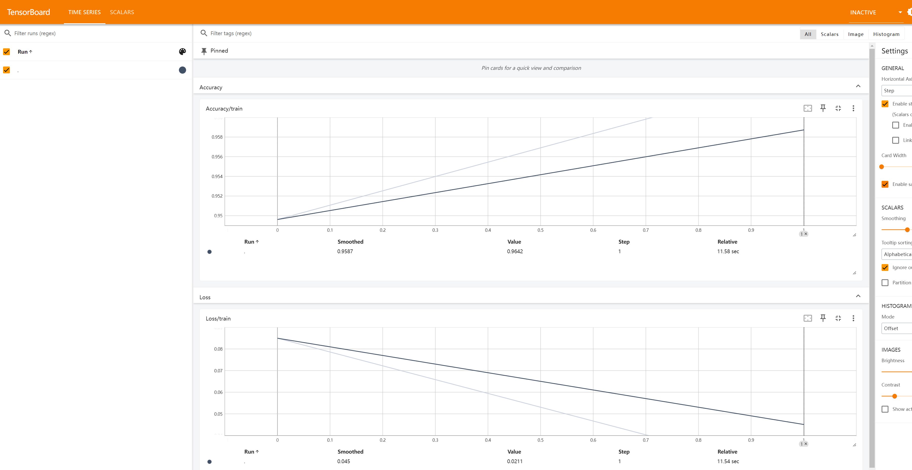

### Tensorboard结果查看
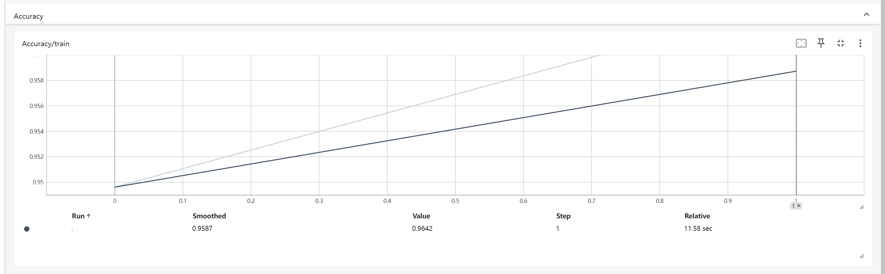
●Accuracy: 这是准确率的总标题。
●Accuracy/train: 这表示正在查看训练过程中模型准确率的变化。
●0.958, 0.956, 0.954, 0.952, 0.95: 这些数字代表不同训练步骤（Step）下模型的准确率，它们随着训练的进行逐渐变化。
●Run↑: 这可能表示当前运行的实验或训练周期。
●0.1, 0.2, 0.3, 0.4, 0.5, 0.6, 0.7, 0.8: 这些是训练周期或时间步长。
●0.9642: 这是在某个时间步长下模型达到的最高准确率。
●11.58 sec: 这表示加载或处理这个准确率图表所花费的时间。
●Relative: 这表示准确率相对于某个基准的变化。
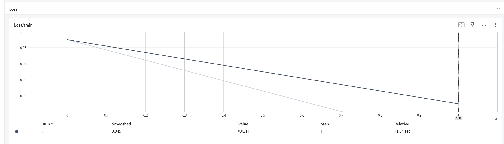

### 本地windows电脑运行代码的预测图片数字结果

由于pycham自带的训练可视化工具，可以直观看到训练结果和状态

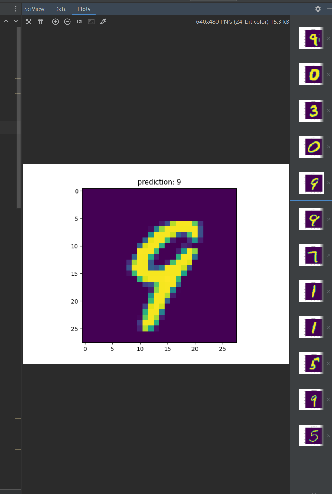


### demo源代码
```pyhton
import time
import torch
import torch.nn as nn
import torch.nn.functional as F
import torch.optim as optim
from torchvision import datasets, transforms
from torch.utils.data import DataLoader
import matplotlib.pyplot as plt
from torch.utils.tensorboard import SummaryWriter
import tensorflow as tf
# 定义网络结构
class Net(nn.Module):
    def __init__(self):
        super(Net, self).__init__()
        self.fc1 = nn.Linear(28 * 28, 64)
        self.fc2 = nn.Linear(64, 64)
        self.fc3 = nn.Linear(64, 64)
        self.fc4 = nn.Linear(64, 10)

    def forward(self, x):
        x = F.relu(self.fc1(x))
        x = F.relu(self.fc2(x))
        x = F.relu(self.fc3(x))
        x = F.log_softmax(self.fc4(x), dim=1)
        return x

# get_data_loader 函数使用 torchvision 库加载 MNIST 数据集，并将其封装成一个 DataLoader 对象，用于在训练过程中批量提供数据。

def get_data_loader(is_train):
    to_tensor = transforms.Compose([transforms.ToTensor()])
    data_set = datasets.MNIST("", is_train, transform=to_tensor, download=True)
    return DataLoader(data_set, batch_size=15, shuffle=True)

# 评估模型
def evaluate(test_data, net):
    n_correct = 0
    n_total = 0
    with torch.no_grad():
        for x, y in test_data:
            x = x.view(-1, 28 * 28).to(device)
            y = y.to(device)
            outputs = net(x)
            for i, output in enumerate(outputs):
                if torch.argmax(output) == y[i]:
                    n_correct += 1
            n_total += y.size(0)
    return n_correct / n_total

# 主函数
def main():
    # 开始时间
    start_time = time.time()
    train_data = get_data_loader(is_train=True)
    test_data = get_data_loader(is_train=False)
    net = Net().to(device)  # 将模型移动到GPU
    optimizer = optim.Adam(net.parameters(), lr=0.001)

    # 记录初始精度
    initial_accuracy = evaluate(test_data, net)
    print("初始精度 initial accuracy:", initial_accuracy)
    # Neolink.AI平台Tensorflow镜像镜像默认指定的tensorboard-logs地址
    logdir = "/root/tensorboard-logs"
    writer = tf.summary.create_file_writer(logdir)

    for epoch in range(2):
        for x, y in train_data:
            x = x.view(-1, 28 * 28).to(device)
            y = y.to(device)
            net.zero_grad()
            output = net(x)
            loss = F.nll_loss(output, y)
            loss.backward()
            optimizer.step()
            # 记录训练损失
            loss_value = loss.item()
            with writer.as_default():
                tf.summary.scalar('Loss/train', loss_value, step=epoch)

        accuracy = evaluate(test_data, net)
        print("时代 epoch", epoch, "精度 accuracy:", accuracy)
        # 记录测试准确率
        with writer.as_default():
            tf.summary.scalar('Accuracy/train', accuracy, step=epoch)

    # 显示预测结果
    for n, (x, _) in enumerate(test_data):
        if n > 3:
            break
        predict = torch.argmax(net(x[0].view(-1, 28 * 28).to(device)))
        plt.figure(n)
        plt.imshow(x[0].view(28, 28).cpu().numpy())  # 将数据移回CPU
        plt.title("预测 prediction: " + str(int(predict)))
    plt.show()

    # 结束时间
    end_time = time.time()
    # 计算运行时间
    elapsed_time = end_time - start_time
    print(f"函数运行时间: {elapsed_time} 秒")

    # 关闭SummaryWriter
    writer.close()

if __name__ == "__main__":
    device = torch.device("cuda" if torch.cuda.is_available() else "cpu")
    main()


```
