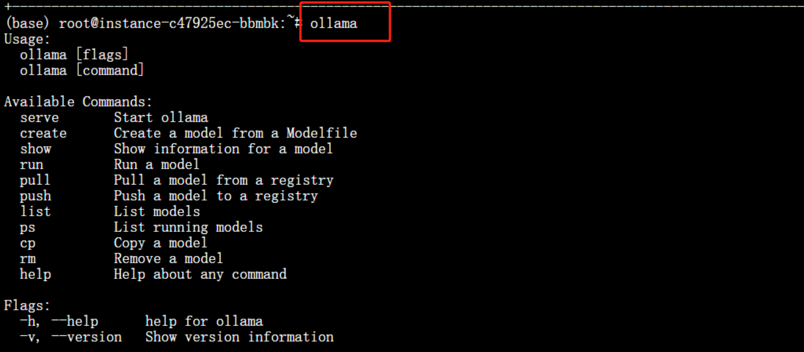
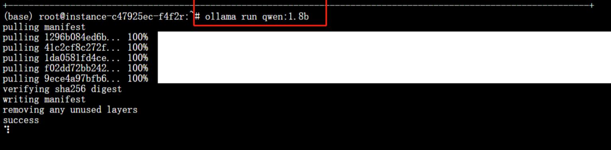
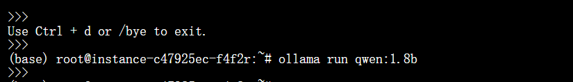

# 利用Neolink.AI平台和Ollama部署语言大模型
<pre>
demo2
├── 校验ollama的运行情况
│  
├── 选择一个模型部署到实例上
│   
├── 详细图解
</pre>


https://neolink-ai.com/ 
注意选择镜像含有ollama的（如果有卡选择的是h100，需要选择-h100）


# 做了什么？
*使用Ollama部署到Neolink.AI语言大模型。*

Ollama 是一个开源工具，它允许用户在本地环境中部署和运行大型语言模型。
部署大语言模型对本地环境的硬件资源有一定要求，正好适合Neolink.AI使用快速上手实例demo。


# 一、校验ollama的运行情况
进入实例的终端中，可以选择ssh连接的方式，也可以选择内置工具Jupyterlab打开终端。
在终端输入
```
ollama
```
# 二、选择一个模型部署到实例上
数字越大下载和部署时间越长
```
ollama run qwen:0.5b
或者
ollama run qwen:1.8b
```
# 三、详细图解

**1.**


**2.**
这里选择1.8的模型，这里我的卡是H-20，部署大概在10min左右



**3.**
等待部署成功,可以在图中看的大模型的对话


**4.**
退出使用ctrl+d
再次运行使用 ollama run qwen:1.8b（你所下载的模型）

