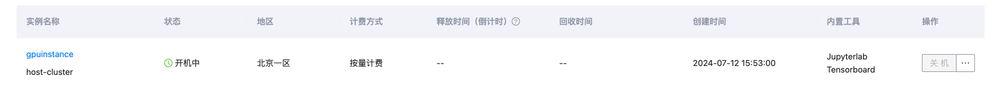

算力实例常用来做算法开发和模型微调，在少量训练数据的前提下可以选择单卡、或者整机 8 卡的实例申请使用，提供本地数据盘，和关联文件存储，使用终端进行算法开发、微调，使用完成后下载成果，释放算力实例。

## 操作步骤

1. 进入左侧侧边栏中的**算力实例**，点击**创建实例**。

    

2. 在**创建实例**页面：选择**付费方式**（按量计费或者包日、包周、包月）、**GPU型号**（4090、H20、H100）、**GPU数量**、**GPU规格**，选择**镜像**（内置了不同的深度学习框架），最后创建即可。对于私有镜像的制作可查看[镜像](../ConfigureEnvironment/image.md)章节。如果你需要更大的硬盘用于存放数据，那么请设置需要扩容的大小。
    
    __NOTE__:考虑到 GPU 型号为 H100 的实例无法联网，我们为这类实例配置了定制化的镜像（镜像名称后缀为 **-h100**），以确保使用 pip 和 apt 进行软件包的安装时能够指向本地源，目前本地源包含的软件包列表与清华源一致。这使得实例在无网络环境下也能顺利完成软件和所需依赖的安装。

    

    在编写和调试代码、上传下载数据到实例、或进行代码展示等不需要使用GPU的场景下，可以选择无卡模式启动。无卡模式下，实例将使用2核CPU、4GB内存，并不配置GPU。该模式的费用为￥0.1/小时。使用无卡模式不会影响实例之前或之后的数据，今后仍然可以在实例列表处切换回正常模式进行开关机操作。

3. 返回算力实例页面，等待算力实例创建完成。已创建成功的实例显示在列，且状态为运行中。

    

4. 算力实例创建完成后，通过 JupyterLab 或者 SSH 连接使用算力实例。

