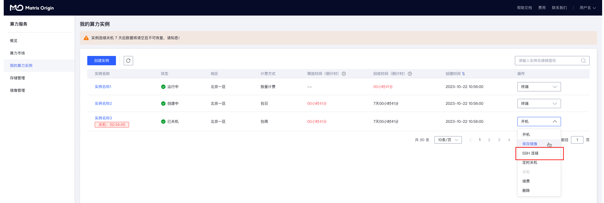
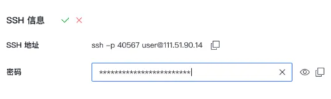

SSH（Secure Shell）是一种网络协议，用于在不安全的网络中安全地访问远程计算机和服务。它提供了一种加密的通信方法，确保数据在传输过程中不被窃听、篡改或伪装。SSH主要用于远程登录和执行命令，但也可以用于其他应用，如文件传输（通过SCP和SFTP）和端口转发。

## SSH访问算力实例

在创建实例成功之后，实例状态显示运行中，在操作一栏中找到SSH登录指令。

复制您的SSH登录指令，这里演示使用的是：ssh -p 40567 user@111.51.90.14

> 在ssh -p 40567 user@111.51.90.14命令中，各个参数的含义为：
> - 用户名：user
> - 主机host：111.51.90.14
> - 端口号：40567

在您的本地终端中输入该命令，输入ssh密码进行登录,即可访问算力实例。

