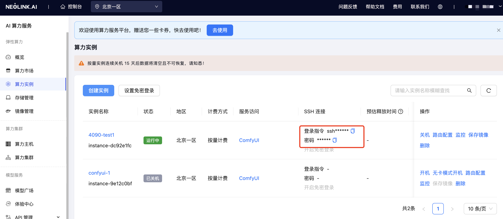
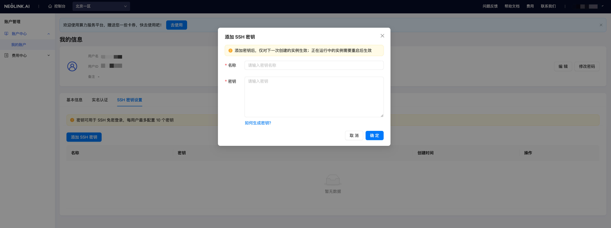

SSH（Secure Shell）是一种网络协议，用于在不安全的网络中安全地访问远程计算机和服务。它提供了一种加密的通信方法，确保数据在传输过程中不被窃听、篡改或伪装。SSH 主要用于远程登录和执行命令，但也可以用于其他应用，如文件传输（通过 SCP 和 SFTP ）和端口转发。

## SSH 登录

在创建实例成功之后，实例状态显示运行中，复制**登录指令**。



在您的本地终端中输入该命令，输入复制的 ssh 密码进行登录，即可访问算力实例。

## 免密登录

Neolink.AI 支持设置 SSH 公钥，通过设置 SSH 公钥可实现免密码登录，减少复制 SSH 登录密码的麻烦，并且更加安全和可靠。

### 如何生成公钥

在不同操作系统中，获取公钥的方法各异。以下是各种系统中获取公钥的具体步骤。如果需要了解更多关于公钥设置的信息，请参考 [GitHub官方文档](https://docs.github.com/en/authentication/connecting-to-github-with-ssh/generating-a-new-ssh-key-and-adding-it-to-the-ssh-agent)

#### Mac

在 Mac 下生成 SSH 密钥并将其添加到 SSH 代理的步骤如下：

1. **检查现有的 SSH 密钥：**
   - 在终端中运行以下命令，检查是否已有 SSH 密钥：
  
    ```bash
    ls -al ~/.ssh
    ```

   - 如果存在 `id_rsa` 或 `id_ed25519` 文件，则表示已有 SSH 密钥，可以跳过生成新密钥的步骤。

2. **生成新的 SSH 密钥：**
   - 在终端中运行以下命令生成一个新的 SSH 密钥，`your_email@example.com` 替换为你的 GitHub 邮箱地址：
  
    ```bash
    ssh-keygen -t ed25519 -C "your_email@example.com"
    ```

   - 如果你的系统不支持 `ed25519`，可以使用 `rsa` 算法：
  
    ```bash
    ssh-keygen -t rsa -b 4096 -C "your_email@example.com"
    ```

   - 当提示输入文件名时，按 `Enter` 保持默认位置（`~/.ssh/id_ed25519` 或 `~/.ssh/id_rsa`）。
   - 设置一个 passphrase（密码短语）来增加密钥的安全性，或者按 `Enter` 跳过。

3. **将 SSH 密钥添加到 SSH 代理：**
   
   - 确保 SSH 代理已启动：
  
    ```bash
    eval "$(ssh-agent -s)"
    ```
     
   - 将生成的 SSH 私钥添加到 SSH 代理：
  
    ```bash
    #如果您的 SSH 公钥文件的名称与示例代码不同，请修改文件名以匹配您当前的设置。
    ssh-add --apple-use-keychain ~/.ssh/id_rsa
    ```

4. **复制 SSH 密钥：**
   
   - 复制 SSH 公钥到剪贴板：
  
    ```bash
    #如果您的 SSH 公钥文件的名称与示例代码不同，请修改文件名以匹配您当前的设置。
    pbcopy < ~/.ssh/id_rsa.pub
    ```

#### Windows

在 Windows 下生成 SSH 密钥并将其添加到 SSH 代理的步骤如下：

1. **检查现有的 SSH 密钥：**
   
   - 在 git bash 中运行以下命令，检查是否已有 SSH 密钥：
  
    ```bash
    ls -al ~/.ssh
    ```

   - 如果存在 `id_rsa` 或 `id_ed25519` 或 `id_ecdsa.pub` 文件，则表示已有 SSH 密钥，可以跳过生成新密钥的步骤。

2. **生成新的 SSH 密钥：**
   
   - 在 git bash 中运行以下命令生成一个新的 SSH 密钥，`your_email@example.com` 替换为你的 GitHub 邮箱地址：
  
    ```bash
    ssh-keygen -t ed25519 -C "your_email@example.com"
    ```

   - 如果你的系统不支持 `ed25519`，可以使用 `rsa` 算法：
  
    ```bash
     ssh-keygen -t rsa -b 4096 -C "your_email@example.com"
    ```

   - 当提示输入文件名时，按 `Enter` 保持默认位置（`~/.ssh/id_ed25519` 或 `~/.ssh/id_rsa`）。
   - 设置一个 passphrase（密码短语）来增加密钥的安全性，或者按 `Enter` 跳过。

3. **将 SSH 密钥添加到 SSH 代理：**
   
   - 确保 SSH 代理已启动：
  
    ```bash
    Get-Service -Name ssh-agent | Set-Service -StartupType Manual
    Start-Service ssh-agent
    ```

   - 将生成的 SSH 私钥添加到 SSH 代理：
  
    ```bash
    #如果您的 SSH 公钥文件的名称与示例代码不同，请修改文件名以匹配您当前的设置。
    ssh-add --apple-use-keychain ~/.ssh/id_rsa
    ```

4. **复制 SSH 密钥：**

    复制 SSH 公钥到剪贴板：

    ```bash
    #如果您的 SSH 公钥文件的名称与示例代码不同，请修改文件名以匹配您当前的设置。
    clip < ~/.ssh/id_rsa.pub
    ```

#### Linux

在 Linux 下生成 SSH 密钥并将其添加到 SSH 代理的步骤如下：

1. **检查现有的 SSH 密钥：**
   
   - 在终端中运行以下命令，检查是否已有 SSH 密钥：
  
    ```bash
    ls -al ~/.ssh
    ```

   - 如果存在 `id_rsa` 或 `id_ed25519` 或 `id_ecdsa.pub` 文件，则表示已有 SSH 密钥，可以跳过生成新密钥的步骤。

2. **生成新的 SSH 密钥：**
   
   - 在终端中运行以下命令生成一个新的 SSH 密钥，`your_email@example.com` 替换为你的 GitHub 邮箱地址：
  
    ```bash
    ssh-keygen -t ed25519 -C "your_email@example.com"
    ```

   - 如果你的系统不支持 `ed25519`，可以使用 `rsa` 算法：
  
    ```bash
    ssh-keygen -t rsa -b 4096 -C "your_email@example.com"
    ```

   - 当提示输入文件名时，按 `Enter` 保持默认位置（`~/.ssh/id_ed25519` 或 `~/.ssh/id_rsa`）。
   - 设置一个 passphrase（密码短语）来增加密钥的安全性，或者按 `Enter` 跳过。

3. **将 SSH 密钥添加到 SSH 代理：**
   
   - 确保 SSH 代理已启动：
  
    ```bash
    eval "$(ssh-agent -s)"
    ```
     
   - 将生成的 SSH 私钥添加到 SSH 代理：
  
    ```bash
    #如果您的 SSH 公钥文件的名称与示例代码不同，请修改文件名以匹配您当前的设置。
    ssh-add --apple-use-keychain ~/.ssh/id_ed25519
    ```

4. **复制 SSH 密钥：**
   
   - 复制 SSH 公钥到剪贴板：
  
    ```bash
    #如果您的 SSH 公钥文件的名称与示例代码不同，请修改文件名以匹配您当前的设置。
    cat ~/.ssh/id_ed25519.pub
    ```
    复制密钥时，请勿添加任何换行符或空格。

### 设置密钥登录

在实例列表界面点击**设置免密登录**，进入到 SSH 公钥设置界面。


在 SSH 公钥设置界面点击**添加SSH密钥**，在弹窗中输入公钥名称和公钥，点击**确定**。添加公钥后，仅对下一次创建的实例生效；对于正在运行的实例，需要先关机再开启免密登录。



至此，您可以直接使用提供的登录指令实现免密码登录。


