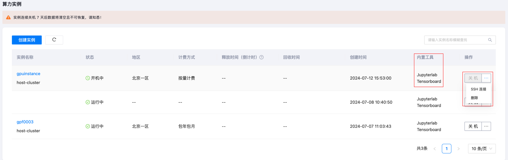

## 创建实例

进入概览页面，进入侧边栏中的**我的算力实例**，点击**创建实例**。

## 租用实例

在**创建实例**页面：选择**地区**，选择**计费方式**（按量计费或者包日、包周、包月），选择**GPU 型号**、**数量**、**规格**，选择**镜像**（内置了不同的深度学习框架），最后创建即可。如果你需要更大的硬盘用于存放数据，那么请设置需要扩容的大小。

创建完成后等待开机，今后主要用到的操作入口如下。

## 上传数据

进入概览页面，开机后在这个正在运行中的实例上找到快捷工具：JupyterLab，点击打开，在下面的截图中找到上传按钮，即可上传数据。

如需上传文件夹或更高级的上传方式等，可进入侧边栏中的**存储管理**，点击**上传文件**，选择所需的代码或数据上传。数据盘建议放在实例下的/root/data 路径。

<!-- 如果需要更多的存储空间，点击创建存储进入新建存储页面，选择地区、付费方式、存储类别、存储大小，设置存储名称，点击立即创建。除新建存储外，也可以对系统默认数据盘进行扩容。 -->
